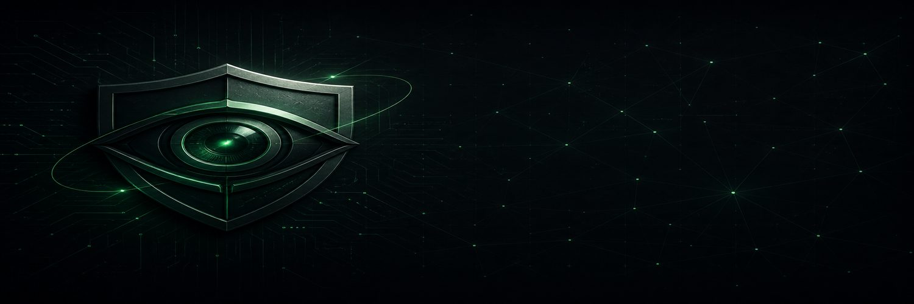
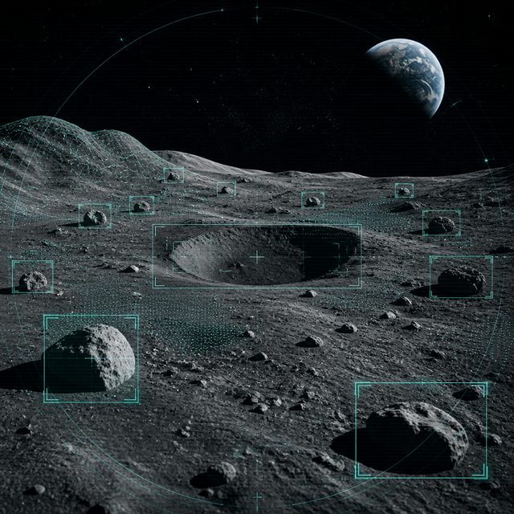
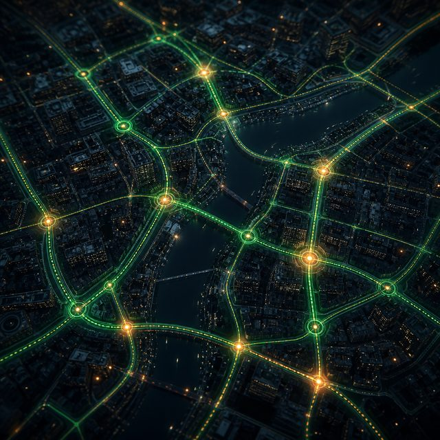

<!--
  ╔══════════════════════════════════════════════════════════════╗
  ║  Padmanaban G  ·  AI/ML Engineer · Cybersecurity Researcher  ║
  ║  Profile aesthetic: Refined Terminal · High-visual portfolio ║
  ╚══════════════════════════════════════════════════════════════╝
-->

<div align="center">
  
</div>

<br/>

```text
██████╗  █████╗ ██████╗ ███╗   ███╗ █████╗ ███╗   ██╗ █████╗ ██████╗  █████╗ ███╗   ██╗
██╔══██╗██╔══██╗██╔══██╗████╗ ████║██╔══██╗████╗  ██║██╔══██╗██╔══██╗██╔══██╗████╗  ██║
██████╔╝███████║██║  ██║██╔████╔██║███████║██╔██╗ ██║███████║██████╔╝███████║██╔██╗ ██║
██╔═══╝ ██╔══██║██║  ██║██║╚██╔╝██║██╔══██║██║╚██╗██║██╔══██║██╔══██╗██╔══██║██║╚██╗██║
██║     ██║  ██║██████╔╝██║ ╚═╝ ██║██║  ██║██║ ╚████║██║  ██║██████╔╝██║  ██║██║ ╚████║
╚═╝     ╚═╝  ╚═╝╚═════╝ ╚═╝     ╚═╝╚═╝  ╚═╝╚═╝  ╚═══╝╚═╝  ╚═╝╚═════╝ ╚═╝  ╚═╝╚═╝  ╚═══╝
```

<div align="center">

[](https://git.io/typing-svg)

<br/>

<a href="https://www.linkedin.com/in/padmanaban2907/">
  
</a>
<a href="mailto:padmanaban.govindarajalu@gmail.com">
  
</a>
<a href="https://github.com/Padmanaban29072004">
  
</a>

<a href="mailto:padmanaban.govindarajalu@gmail.com">
  
</a>


</div>

---

<div align="center">

### 🏆 Recognition


</div>

---

<div align="center">

```bash
$ whoami
> padmanaban_g
> role     : AI/ML Engineer · Cybersecurity Researcher · Computer Vision Builder
> focus    : Multi-agent systems · Lunar CV · Production SOC tooling
> location : Chennai, TN · open to Chennai · Bangalore · Hyderabad
> status   : actively seeking AI/ML engineering roles
```

</div>

---

## 👋 About Me


I build **production-minded AI systems** at the intersection of multi-agent orchestration, computer vision, and cybersecurity.

- 🛰️ Lunar surface analysis for ISRO research (Chandrayaan-2)
- 🛡️ Real-time threat detection for SOC pipelines
- 🏙️ Geospatial multi-agent systems for smart cities
- 📈 Time-series ML that ships with measurable targets

I care about systems that hold up outside a demo — clear architecture, measurable latency, and outcomes you can trust.

<br clear="both"/>

---

## 🚀 Featured Projects

<table>
  <tr>
    <td width="50%" align="center" valign="top">
      
      <h3>🛡️ PHANTOM-Flow</h3>
      <p><b>Multi-Agent Cybersecurity</b></p>
      <p>Real-time network threat detection via orchestrated AI agents for production SOC pipelines.</p>
      <p>
        
        
        
      </p>
      <code>&lt; 3ms anomaly detection · Deployed</code>
    </td>
    <td width="50%" align="center" valign="top">
      
      <h3>🌕 LunaLens</h3>
      <p><b>Space Computer Vision</b></p>
      <p>Crater &amp; boulder detection on lunar imagery for ISRO. Presented at ISSF 2026.</p>
      <p>
        
        
        
      </p>
      <code>Chandrayaan-2 · Research</code>
    </td>
  </tr>
  <tr>
    <td width="50%" align="center" valign="top">
      
      <h3>🏙️ UrbanFlow</h3>
      <p><b>Smart City Platform</b></p>
      <p>AI-powered traffic &amp; route optimization using geospatial multi-agent LLMs.</p>
      <p>
        
        
        
      </p>
      <code>Urban mobility · Active</code>
    </td>
    <td width="50%" align="center" valign="top">
      
      <h3>🔍 AQI Forecaster</h3>
      <p><b>Time Series ML</b></p>
      <p>Air quality forecasting with lag features, rolling stats &amp; cyclic temporal encoding.</p>
      <p>
        
        
        
      </p>
      <code>MAE &lt; 65 · Complete</code>
    </td>
  </tr>
</table>

---

## 🛠️ Tech Stack

### Languages
<p align="center">
  
</p>

### AI / ML & Data
<p align="center">
  
</p>

### Frontend & Automation
<p align="center">
  
</p>

### Security Arsenal
<p align="center">
  
  
  
  
  
  
</p>

<p align="center">
  
  
  
  
  
  
  
</p>

---

## 🏆 GitHub Trophies

<div align="center">
  
  alt="GitHub Trophies"/>
</div>

---

## 📊 GitHub Analytics

<div align="center">

  
  

</div>

<div align="center">
  
</div>

---

## 📈 Contribution Insights

<div align="center">

  

</div>

<br/>

<div align="center">
  <a href="https://github.com/Padmanaban29072004">
    
  </a>
  <a href="https://github.com/Padmanaban29072004">
    
  </a>
</div>

<div align="center">
  <a href="https://github.com/Padmanaban29072004">
    
  </a>
  <a href="https://github.com/Padmanaban29072004">
    
  </a>
</div>

<br/>

<div align="center">
  
  <br/>
  <sub>Contribution calendar · last 12 months</sub>
</div>

---

## 🐍 Contribution Snake

<div align="center">

<!-- Instant snake (always available) -->


<!-- After first Actions run, the animated GIF below will light up -->
<picture>
  <source media="(prefers-color-scheme: dark)" srcset="https://raw.githubusercontent.com/Padmanaban29072004/Padmanaban29072004/output/github-contribution-grid-snake-dark.svg"/>
  <source media="(prefers-color-scheme: light)" srcset="https://raw.githubusercontent.com/Padmanaban29072004/Padmanaban29072004/output/github-contribution-grid-snake.svg"/>
  
</picture>


</div>

---

## 📡 Signal Map

<div align="center">

| Focus | Signal |
|:------|:-------|
| 🤖 Multi-Agent Systems | LangChain · LangGraph · Production orchestration |
| 👁️ Computer Vision | YOLOv8 · ViT · Space / lunar imagery |
| 🛡️ Cybersecurity | SOC pipelines · Anomaly detection · Offensive tooling |
| 🌆 Smart Cities | Geospatial AI · Urban mobility optimization |
| 📊 Applied ML | Time series · Forecasting · Feature engineering |

</div>

---

## 🤝 Let's Connect

<div align="center">

```text
> session  : authenticated
> seeking  : AI/ML Engineering roles
> prefer   : Chennai · Bangalore · Hyderabad
> contact  : padmanaban.govindarajalu@gmail.com
> linkedin : linkedin.com/in/padmanaban2907
> EOF
```

<br/>

<a href="mailto:padmanaban.govindarajalu@gmail.com">
  
</a>
<a href="https://www.linkedin.com/in/padmanaban2907/">
  
</a>
<a href="https://github.com/Padmanaban29072004?tab=repositories">
  
</a>

</div>

---

<div align="center">
  
  <br/>
  <sub>Built with intention · Open to opportunities · Always shipping</sub>
</div>
